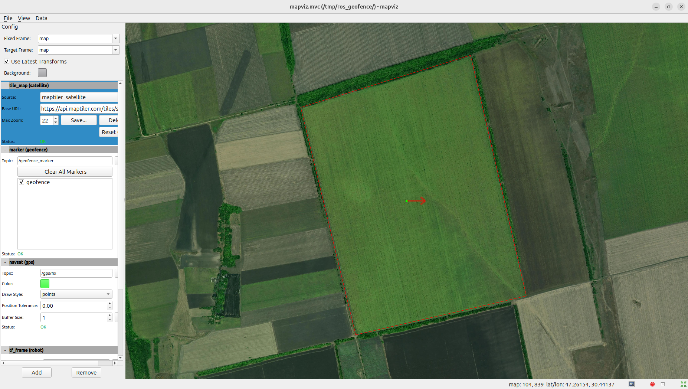

# ros_geofence

ROS 2 пакет для перевірки знаходження робота в межах визначеної географічної зони (geofence).



## Опис

Пакет дозволяє:
- Завантажувати зону з GeoJSON файлу
- Перевіряти чи робот знаходиться в межах зони на основі GPS координат
- Публікувати межі зони для візуалізації в Mapviz

## Залежності

- ROS 2 (Humble/Iron/Jazzy)
- mapviz, mapviz_plugins
- swri_transform_util
- PROJ (бібліотека для картографічних проекцій)
- nlohmann_json

## Встановлення

```bash
cd ~/ros2_ws/src
git clone https://github.com/Fastroof/ros_geofence.git
cd ~/ros2_ws
rosdep install --from-paths src --ignore-src -r -y
colcon build --packages-select ros_geofence
source install/setup.bash
```

## Налаштування MapTiler API

Для відображення супутникових тайлів потрібен API ключ від [MapTiler](https://www.maptiler.com/).

Встановіть змінну середовища:

```bash
# Додайте в ~/.bashrc для постійного використання
export MAPTILER_API_KEY="your_api_key_here"
```

Або передайте ключ як параметр при запуску:

```bash
ros2 launch ros_geofence bringup.launch.py maptiler_api_key:=your_api_key_here
```

## Використання

### Запуск всіх компонентів

```bash
ros2 launch ros_geofence bringup.launch.py
```

### Запуск zone_checker

```bash
ros2 launch ros_geofence zone_checker.launch.py
```

## Формат GeoJSON

Приклад файлу zone.geojson:

```json
{
  "type": "FeatureCollection",
  "features": [{
    "type": "Feature",
    "properties": {},
    "geometry": {
      "type": "Polygon",
      "coordinates": [[
        [30.4309, 47.2594],
        [30.4356, 47.2461],
        [30.4502, 47.2484],
        [30.4454, 47.2624],
        [30.4309, 47.2594]
      ]]
    }
  }]
}
```

## Ліцензія

Apache-2.0
